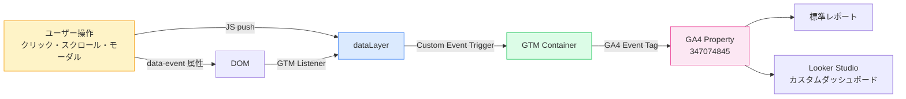
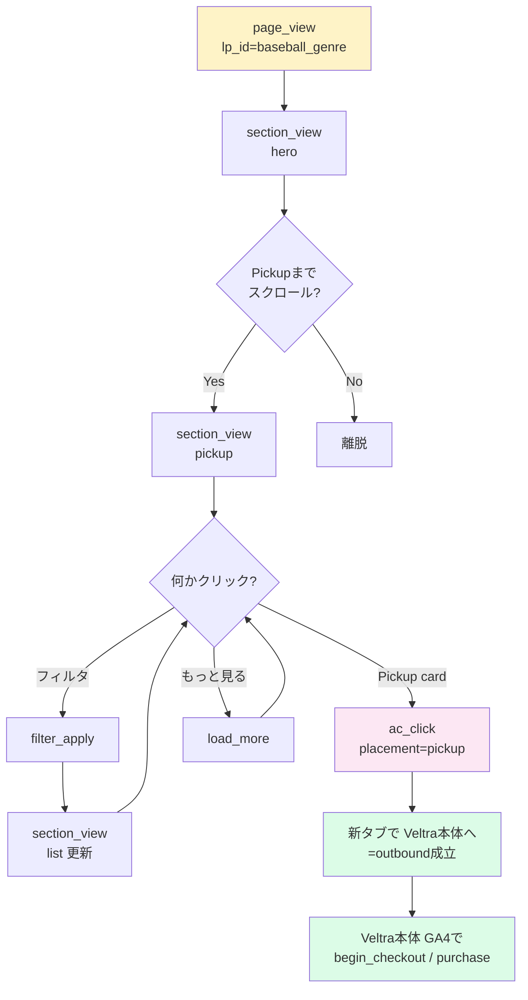
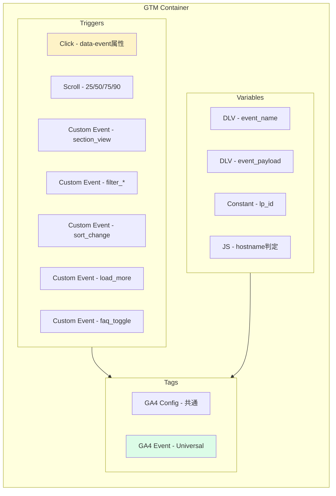
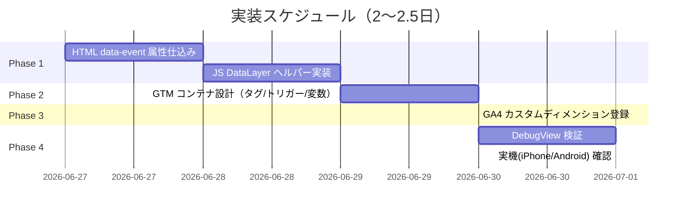

# GTM / GA4 計測プラン — Baseball Genre LP

> **対象**: `planning/sports-mock/baseball/index.html`
> **GA4 Property**: `347074845`
> **方針**: ジャンル横断（野球→演劇→グルメ…）で再利用できるイベント設計

---

## 1. 目的

Genre LP ごとに「どのコンテンツが効いているか」を Veltra 全体の意思決定に
使えるレベルで可視化する。具体的には次の問いに答えられること:

- どのセクションで離脱しているか（Hero / Reasons / Pickup / List / Guide / FAQ）
- どの AC がよくクリックされ、そこから Veltra 本体へ送客できているか
- 絞り込み・ソートの利用傾向（=どの軸が探索ニーズか）
- LP の主要ファネル: `lp_view → filter_apply → ac_click → outbound_click`

---

## 2. 全体アーキテクチャ



**ポイント**:
- HTML 側は `data-event` / `data-payload` 属性を要素に仕込むだけ。GTMが listener で吸い上げる
- 複雑な操作（モーダル開閉、ソート変更）は JS から `dataLayer.push()` で明示的に送る
- 全イベントに `lp_id=baseball_genre` を自動付与 → 後で演劇 LP との横並び比較が可能に

---

## 3. 計測イベント一覧

### 3.1 標準イベント（GTM ビルトイン）

| # | event | 発火条件 | 主要 param |
|---|---|---|---|
| 1 | `page_view` | ページ表示 | `page_location`, `page_title`, `lp_id` |
| 2 | `scroll` | スクロール深度到達 | `percent_scrolled` ∈ {25, 50, 75, 90} |

### 3.2 カスタムイベント

| # | event | 発火条件 | 主要 param | 補足 |
|---|---|---|---|---|
| 3 | `section_view` | 各セクションが画面に50%入った時 | `section` ∈ {hero, reasons, pickup, list, guide, faq, footer} | IntersectionObserver |
| 4 | `ac_click` | AC カードのクリック | `ac_id`, `ac_position`, `placement` ∈ {pickup, grid}, `card_index` | outbound と統合 |
| 5 | `filter_apply` | 絞り込みチップ押下（追加/解除） | `filter_group` ∈ {city, team, cat, type}, `filter_value`, `state` ∈ {add, remove}, `from` ∈ {pc, modal}, `result_count` | |
| 6 | `filter_modal_open` | SP モーダル開く | `modal` ∈ {city, team, cat, type} | SP のみ |
| 7 | `filter_modal_close` | SP モーダル閉じる | `modal`, `result_count`, `applied_count` | 閉じた時点での結果件数 |
| 8 | `filter_clear` | 「クリア」押下 | `clear_target` ∈ {all, single}, `cleared_count` | |
| 9 | `sort_change` | ソート選択変更 | `sort_value` ∈ {recommend, rating, price_asc, price_desc, new} | |
| 10 | `load_more` | 「もっと見る」押下 | `current_count`, `next_count`, `total` | |
| 11 | `faq_toggle` | FAQ 開閉 | `question_id`, `state` ∈ {open, close} | |
| 12 | `guide_click` | 観戦ガイド4カードのクリック | `guide_card` ∈ {preparation, access, seat, tips} | |
| 13 | `header_action` | ヘッダー検索/メニュー/ログイン | `action` ∈ {search, menu, login, signup} | |
| 14 | `footer_link_click` | フッター内リンク | `link_text`, `link_url` | |
| 15 | `outbound_click` | Veltra 本体への外部遷移 | （= #4 と統合） | **重複防止のため #4 と同イベント扱い** |

---

## 4. カスタムディメンション / メトリクス

GA4 管理画面で登録（パラメータをそのままレポート粒度として使うために必要）。

| 種別 | 名前 | スコープ | 用途 |
|---|---|---|---|
| ディメンション | `lp_id` | event | LP 横断分析（baseball_genre / theater_genre …） |
| ディメンション | `section` | event | セクション別ファネル |
| ディメンション | `ac_id` | event | AC 別 CTR |
| ディメンション | `ac_position` | event | グリッド内順位（hero=0、以降1〜） |
| ディメンション | `placement` | event | pickup / grid / related |
| ディメンション | `filter_group` | event | エリア/球団/カテゴリのどれが多く使われるか |
| ディメンション | `filter_value` | event | 個別フィルタ値別 |
| ディメンション | `sort_value` | event | ソート使用傾向 |
| ディメンション | `guide_card` | event | ガイド4カード別CTR |
| **メトリクス** | `result_count` | event | 絞り込み結果件数（中央値等で集計） |

---

## 5. データレイヤー設計

### 5.1 共通エンベロープ

すべての `dataLayer.push()` は以下の構造で統一:

```js
dataLayer.push({
  event: 'ac_click',           // GA4 event名と1:1
  lp_id: 'baseball_genre',     // 全イベント自動付与
  event_payload: {             // GA4側のevent paramsにflatten
    ac_id: '183789',
    ac_position: 3,
    placement: 'pickup',
    card_index: 1,
    dest_url: 'https://www.veltra.com/jp/.../a/183789'
  }
});
```

GTM 側で `event_payload` をループしてGA4タグの paramsに展開（変数 `DLV - event_payload`）。

### 5.2 HTML側のお作法

クリック系は data 属性で完結:

```html
<a class="ac-card"
   href="https://www.veltra.com/jp/.../a/183789"
   target="_blank"
   data-event="ac_click"
   data-payload='{"ac_id":"183789","ac_position":3,"placement":"pickup","card_index":1}'>
  ...
</a>
```

GTM の「DOM Element Listener」で `data-event` 属性のある要素を全部拾い、
`data-payload` を JSON.parse して dataLayer に push する1個のスクリプトタグで処理。

---

## 6. ファネル設計（イベント連鎖）



このファネルで:
- **A→D** の通過率 = LP のフック力
- **D→F** の通過率 = Pickup 設計力
- **F→K** の通過率 = LP→本体への送客接続力（ベルトラ本体の GA4 と紐付け要）

---

## 7. GTM コンテナ構成



**ポイント**:
- GA4 Event タグは **1個だけ**（Universal）作り、event_name と params を変数から動的に渡す
- 環境分岐は `V4 - JS hostname` で本番/プレビューを判定 → プレビューは `debug_mode=true` で送る or 送らない
- LP 横展開時は HTML 側の `lp_id` だけ書き換える運用

---

## 8. 実装フェーズ



| Phase | 主担当 | 成果物 |
|---|---|---|
| 1 | エンジニア（Claude） | HTML + JS PR |
| 2 | マーケ/アナリスト | GTM Container Workspace |
| 3 | GA4 管理者 | カスタムディメンション登録 |
| 4 | エンジニア + マーケ | DebugView 確認・修正 |

---

## 9. 検証チェックリスト

- [ ] GTM Preview Mode で各イベントが期待 param で発火する
- [ ] GA4 DebugView で受け取り確認
- [ ] `data-payload` が壊れた JSON でも JS が落ちない
- [ ] `<a target="_blank">` の遷移前に GA4 が送信完了する（beacon）
- [ ] プレビュー環境（`*-git-*.vercel.app`）が本番GA4を汚さない
- [ ] iPhone / Android 実機で SP モーダル系が発火する
- [ ] `load_more` 連打分が全部発火する
- [ ] 二重発火が無いか（特に `ac_click` ↔ `outbound_click`）

---

## 10. 競合・落とし穴

| 課題 | 対応 |
|---|---|
| 同一クリックを `ac_click` と `outbound_click` で二重計上 | **`ac_click` 一本に統合**、`dest_url` を param に含める |
| `target="_blank"` で送信前にナビゲートされる | GTM の Send to GA4 で `transport_type=beacon` |
| フィルタを同じチップで2回押すと2回発火 | `state=add/remove` を param に持たせて分析側で区別 |
| プレビュー環境の本番GA4汚染 | `hostname` Lookupで本番のみ送信、または `traffic_type=internal` を付与 |
| ジャンル横断比較したい | 全イベントに `lp_id` 付与 → 演劇/グルメ LP もこの規約に従わせる |

---

## 11. 進め方（提案）

1. ✅ **本ドキュメント** = 設計合意
2. ⬜ **HTML/JS 実装PR**（私が担当・1日）
3. ⬜ **GTM Container 設定**（マーケ or 私が設定書 .md を生成）
4. ⬜ **GA4 カスタムディメンション登録**（GA4 管理者）
5. ⬜ **DebugView 検証**
6. ⬜ **本番リリース**
7. ⬜ **2週間後レビュー**: データが期待通り取れているか、追加で測りたい項目はあるか

---

## 12. 将来拡張

- 演劇 LP / グルメ LP / 歴史 LP リリース時に `lp_id` だけ書き換えて同じ規約を流用
- A/B Test 連携: Pickup の出し方を変えた版を `experiment_id` param で識別
- LP → Veltra本体 の cross-site tracking 強化（同一クライアントID共有）
- `result_count = 0` の絞り込み発生回数を別途モニタ → UX改善のシグナル

---

> 質問・追加項目あれば本ファイルにコメント追記 or Slackで。
