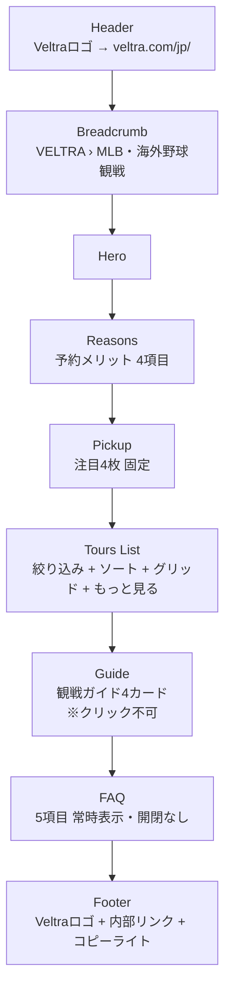
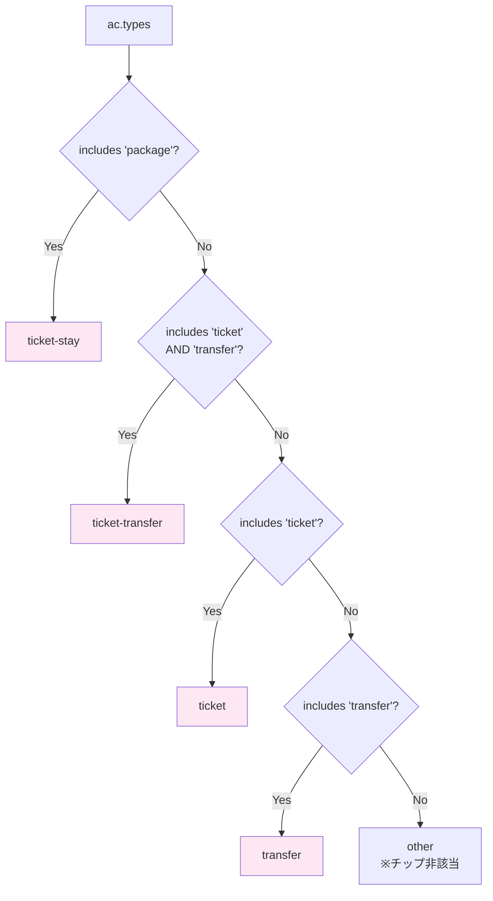
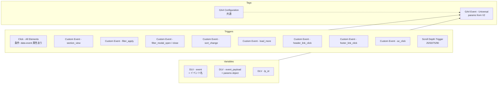
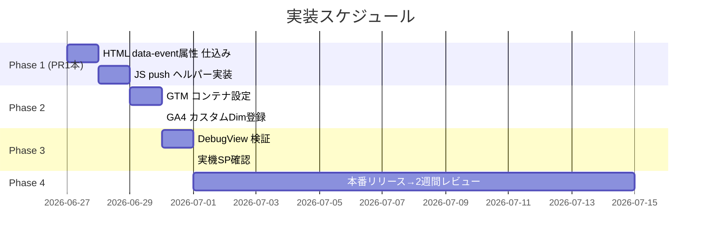

# Baseball Genre LP — 現状仕様 + GA4 計測設計

> **対象**: `planning/sports-mock/baseball/index.html`
> **目的**: 既存の絞り込み/ソート/Pickup ロジックを明文化し、その上に乗せる GA4 計測設計を確定する。
> **位置づけ**: `gtm-ga4-plan.md`（全体方針）の **実装直前版**。本ドキュメントが実装PRの依拠となる。

---

## 第1部 現状仕様

### 1.1 ページ構成（縦の並び）



### 1.2 Pickup ロジック

- **完全固定** の AC ID 配列：

  ```js
  const PICKUP_IDS = ['183789','192599','203447','193811'];
  // 1. ドジャース観戦(JTBアーリーエントリー)
  // 2. ヤンキース観戦(日本語ガイド)
  // 3. フィラデルフィア・オールスター2026
  // 4. ドジャース・プリゲーム(選手用具タッチ)
  ```

- レンダリングは `byId[id]` で ACS 配列から引いて `cardHtml()` を流用。
- ソート・絞り込みの影響は受けない。

### 1.3 絞り込み（3軸 × 内OR / 軸間AND）

| 軸 | チップ表示 | データソース | 取り得る値 |
|---|---|---|---|
| **エリア (city)** | 主要5 + 「他N都市」展開 | `ac.city`（文字列） | `CITY_PRIMARY` 5 件 + `CITY_EXTRA` 12 件（計17） |
| **球団 (team)** | 主要6 + 「他N球団」展開 | `ac.team`（slug） | `TEAM_PRIMARY` 6 + `TEAM_EXTRA` 26（計32） |
| **タイプ (cat)** | 4 件 固定 | `acCategory(ac)` 関数で導出 | `ticket` / `ticket-transfer` / `ticket-stay` / `transfer` |

#### `acCategory(ac)` の判定優先順（排他的）



#### 絞り込みフィルタの組み合わせロジック

```js
ACS.filter(ac =>
  (cityフィルタが空 || cityフィルタに ac.city が含まれる) &&
  (teamフィルタが空 || teamフィルタに ac.team が含まれる) &&
  (catフィルタが空 || catフィルタに acCategory(ac) が含まれる)
)
```

- **同一軸内は OR**: 「ロサンゼルス OR ニューヨーク」
- **軸間は AND**: 「(LA or NY) AND (ドジャース or ヤンキース) AND (チケット+送迎)」
- **空 = 制約なし**: ある軸が空なら全件通過

### 1.4 並び順ロジック

| ソート値 | ラベル | 動作 |
|---|---|---|
| `recommend` *(default)* | おすすめ順 | **`ACS` 配列の宣言順を維持**（≒ 編集判断による静的ランキング） |
| `rating` | 評価が高い順 | `b.rating - a.rating`（null は 0 扱いで最後尾に集まる） |
| `price-asc` | 料金が安い順 | `a.price - b.price` |
| `price-desc` | 料金が高い順 | `b.price - a.price` |

> **`recommend` のソースは `ACS` 宣言順**。現在の順は手動で決めており、ドジャース系上位 → NY系 → その他MLB → 台湾 という編集者意図順。

### 1.5 もっと見る（pagination）

- 初期表示 `PAGE_SIZE = 16` 件
- 「もっと見る」押下で `STATE.shown += PAGE_SIZE`（次の16件を追加描画）
- 全件表示後はボタンを非表示

### 1.6 モバイル絞り込みモーダル

- 992px 未満で `.filter-section`（PC版）が消え、`.filter-mobile` のチップ列が表示
- エリア/球団/タイプのトリガーチップをタップ → モーダル開く
- モーダル内で複数選択して「適用」 → 状態確定
- カテゴリ（cat）はモーダルなしで直接トグル可能

### 1.7 FAQ

- accordion 無し。`.faq-item` × 5件が常時開いた状態で並んでいるだけ。
- → **開閉計測の対象なし**

### 1.8 Header / Footer の遷移リンク

| 配置 | クリック先 |
|---|---|
| Header Veltra ロゴ | `https://www.veltra.com/jp/` |
| Breadcrumb 「VELTRA」 | `https://www.veltra.com/jp/` |
| Footer Veltra ロゴ | `https://www.veltra.com/jp/` |
| Footer 内部リンク | （実装次第で複数）会社情報 / 利用規約 / ヘルプ等 |

---

## 第2部 GA4 計測設計（確定版）

### 2.1 計測する／しないの確定

| # | 元プラン | 採否 | 備考 |
|---|---|---|---|
| 1 | page_view | ✅ | 全イベントに `lp_id=baseball_genre` 付与 |
| 2 | scroll | ✅ | 25/50/75/90 |
| 3 | section_view | ✅ | hero/reasons/pickup/list/guide/faq/footer |
| 4 | ac_click (Pickup) | ✅ | **どの AC が押されたか分かる** |
| 5 | ac_click (Grid) | ✅ | 同上 |
| 6 | filter_apply | ✅ | **どの絞り込みボタンが押されたか + 押下後の組み合わせ** |
| 7 | filter_modal_open | ✅ | |
| 8 | filter_modal_close | ✅ | 閉じた時点での `applied_count` と `result_count` を取得（モーダル内での意思決定の有無分析用） |
| 9 | filter_clear | ❌ | 不要 |
| 10 | sort_change | ✅ | |
| 11 | load_more | ✅ | |
| 12 | faq_toggle | ❌ | 開閉UIなし |
| 13 | guide_click | ❌ | クリック不可 |
| — | **header_link_click** | ✅ | **新規追加**: Veltra TOP への 3 入口（header logo / breadcrumb / footer logo）を識別 |
| 14 | header_action (search) | ❌ | 検索UIなし |
| 15 | footer_link_click | ✅ | **どのリンクが押されたか分かる** |
| 16 | outbound_click | ✅ | **AC=#4/#5 と統合**、その他外部リンクは別系統で扱う |

→ 計測イベント **計 12 種類**

### 2.2 絞り込みセットの集計（新規要件）

「どの絞り込みセット（=フィルタの組み合わせ）がよく使われるか」を分析するため、
`filter_apply` イベント発火時に **その時点の active filter 全体** を 1 つのパラメータに
スナップショットとして付与する。

#### Payload 設計

```js
{
  event: 'filter_apply',
  lp_id: 'baseball_genre',
  event_payload: {
    filter_group: 'city',          // どの軸が変化したか
    filter_value: 'ロサンゼルス',   // 何が選ばれた/外れたか
    state: 'add',                  // add / remove
    from: 'pc',                    // pc / modal

    // ↓ "絞り込みセット" 集計用スナップショット
    active_city: 'ロサンゼルス|ニューヨーク',  // ソート済みパイプ区切り
    active_team: 'dodgers',
    active_cat: 'ticket-transfer',
    active_filter_count: 3,                  // 全軸合計の選択数
    active_filter_signature: 'city=ロサンゼルス|ニューヨーク;team=dodgers;cat=ticket-transfer',
    result_count: 7                          // 適用後の結果件数
  }
}
```

- **`active_filter_signature`** が "セット" の identifier
  → GA4 で `count by active_filter_signature` すれば人気組み合わせ TOP10 が出る
- 値は必ず **ソート済み** にして "(LA,NY)" と "(NY,LA)" を同一視
- 空軸（選択なし）はキー自体を含めない → "city=ロサンゼルス;cat=ticket" のように軸数も可変

#### 集計クエリ例（GA4 → BigQuery export 想定）

```sql
SELECT
  (SELECT value.string_value FROM UNNEST(event_params) WHERE key='active_filter_signature') sig,
  COUNT(*) cnt
FROM `*.events_*`
WHERE event_name = 'filter_apply'
  AND (SELECT value.string_value FROM UNNEST(event_params) WHERE key='lp_id') = 'baseball_genre'
GROUP BY sig ORDER BY cnt DESC LIMIT 20
```

### 2.3 確定イベントマトリクス

| event | 主要 param | 補足 |
|---|---|---|
| `page_view` | （標準） | `lp_id` を user_property or event_param で常時付与 |
| `scroll` | `percent_scrolled` (25/50/75/90) | GTM ビルトイン |
| `section_view` | `section` ∈ {hero, reasons, pickup, list, guide, faq, footer} | IntersectionObserver |
| `ac_click` | `ac_id`, `ac_position`, `placement` ∈ {pickup, grid}, `card_index`, `dest_url` | クリック = 外部遷移なので outbound_click を兼ねる |
| `filter_apply` | 上 2.2 参照 | "セット" 集計可能 |
| `filter_modal_open` | `modal` ∈ {city, team, cat} | SP のみ |
| `filter_modal_close` | `modal`, `result_count`, `applied_count`, `changed`（true/false） | SP のみ、開いてから閉じるまでの状態変化を把握 |
| `sort_change` | `sort_value` ∈ {recommend, rating, price-asc, price-desc} | |
| `load_more` | `current_count`, `next_count`, `total` | |
| `header_link_click` | `link_target` ∈ {header_logo, breadcrumb_veltra, footer_logo}, `dest_url` | Veltra TOP 系の3入口 |
| `footer_link_click` | `link_text`, `link_url` | Footer 内部リンク（Veltra TOP 以外） |
| `outbound_click` | — | **`ac_click` と統合**、それ以外の外部遷移用に別途使用可能（現状用途なし） |

### 2.4 カスタムディメンション登録一覧

GA4 管理画面で必要なもの:

| 名前 | スコープ | 用途 |
|---|---|---|
| `lp_id` | event | LP 横断（baseball_genre / theater_genre …） |
| `section` | event | セクション別ファネル |
| `ac_id` | event | AC 別 CTR |
| `ac_position` | event | グリッド内順位 |
| `placement` | event | pickup / grid |
| `card_index` | event | 配置内の位置（1〜N） |
| `filter_group` | event | city / team / cat |
| `filter_value` | event | 個別フィルタ値 |
| `active_filter_signature` | event | **絞り込みセット集計の鍵** |
| `active_filter_count` | event | 何軸何件絞ったか |
| `result_count` | event metric | 適用後の結果件数 |
| `sort_value` | event | ソート傾向 |
| `link_target` | event | header_logo / breadcrumb_veltra / footer_logo |
| `link_url` | event | 外部遷移先 URL |

### 2.5 仕込み設計（HTML / JS 実装方針）

#### A) data 属性方式（クリック系の大半）

```html
<!-- ACカード（Pickup）-->
<a class="ac-card" href="{ac.url}" target="_blank" rel="noopener"
   data-event="ac_click"
   data-payload='{"ac_id":"183789","ac_position":3,"placement":"pickup","card_index":1,"dest_url":"https://www.veltra.com/jp/.../a/183789"}'>...</a>

<!-- ACカード（Grid）-->
<a class="ac-card" data-event="ac_click"
   data-payload='{"ac_id":"108997","ac_position":12,"placement":"grid","card_index":12,"dest_url":"..."}'>...</a>

<!-- Header logo / Breadcrumb Veltra / Footer logo -->
<a class="v-logo" href="https://www.veltra.com/jp/"
   data-event="header_link_click"
   data-payload='{"link_target":"header_logo","dest_url":"https://www.veltra.com/jp/"}'>...</a>

<!-- Footer 内リンク -->
<a href="..." data-event="footer_link_click"
   data-payload='{"link_text":"利用規約","link_url":"..."}'>...</a>

<!-- 絞り込みチップ (PC) -->
<button class="f-chip" data-group="city" data-value="ロサンゼルス"
        data-event="filter_apply" data-from="pc">...</button>
```

→ 全 `data-event` を1つの listener で吸い上げる JS をページ末尾に追加:

```js
document.addEventListener('click', (e) => {
  const el = e.target.closest('[data-event]');
  if (!el) return;
  const eventName = el.dataset.event;
  let payload = {};
  try { payload = JSON.parse(el.dataset.payload || '{}'); } catch {}

  // filter_apply の場合は active_* を動的に補完
  if (eventName === 'filter_apply') {
    payload = { ...payload, ...buildFilterSnapshot(el) };
  }

  window.dataLayer.push({
    event: eventName,
    lp_id: 'baseball_genre',
    event_payload: payload,
  });
});
```

#### B) JS push 方式（DOM では捉えにくいもの）

| イベント | 仕込み箇所 |
|---|---|
| `section_view` | IntersectionObserver で `[data-section]` 要素を観測、初回50%超過で push |
| `filter_modal_open` | `openFilterModal()` 関数内で push |
| `filter_modal_close` | `closeFilterModal()` 関数内で push（開いた時点の state を保持し、閉じる時に diff を取って `changed` 判定） |
| `sort_change` | `#sort-baseball` の `change` listener 内で push（既存 listener に1行追加） |
| `load_more` | `#load-more` ハンドラ内で push |

#### C) `buildFilterSnapshot()` 関数（要新規）

```js
function buildFilterSnapshot() {
  const c = [...STATE.filters.city].sort();
  const t = [...STATE.filters.team].sort();
  const k = [...STATE.filters.cat].sort();
  const parts = [];
  if (c.length) parts.push(`city=${c.join('|')}`);
  if (t.length) parts.push(`team=${t.join('|')}`);
  if (k.length) parts.push(`cat=${k.join('|')}`);
  return {
    active_city: c.join('|'),
    active_team: t.join('|'),
    active_cat: k.join('|'),
    active_filter_count: c.length + t.length + k.length,
    active_filter_signature: parts.join(';'),
    result_count: filterAcs().length,
  };
}
```

### 2.6 GTM コンテナ設計



GA4 Event タグは Universal 1個だけ。Event Name = `{{DLV - event}}`、parameters = `{{DLV - event_payload}}` を展開。

### 2.7 環境分離

```js
const isProduction =
  location.hostname === 'v2-veltra-cvr.vercel.app';
// プレビュー(*-git-*) は debug_mode=true で送信、本番GA4の主要レポートは汚さない
```

GTM の "GA4 Config" タグで `debug_mode = {{isProduction ? false : true}}`。

### 2.8 検証チェックリスト

- [ ] GTM Preview で `ac_click`(pickup) と `ac_click`(grid) の `placement` が正しく分かれる
- [ ] `filter_apply` の `active_filter_signature` が "city=...;team=...;cat=..." の形式で生成される
- [ ] 同じチップを2回押すと `state=add` → `state=remove` で2イベント
- [ ] `<a target="_blank">` 遷移前に GA4 ヒット送信完了（beacon）
- [ ] `header_link_click` で 3 入口（header_logo / breadcrumb_veltra / footer_logo）が区別できる
- [ ] スクロール 90% 到達で `scroll` event 発火
- [ ] プレビュー環境では `debug_mode=true` が付く

### 2.9 実装フェーズ



| Phase | 担当 | 成果物 |
|---|---|---|
| 1 | エンジニア（Claude） | HTML/JS PR 1本 |
| 2 | マーケ/アナリスト | GTM コンテナ + GA4管理画面設定 |
| 3 | エンジニア＋マーケ | DebugView 検証 |
| 4 | マーケ | 2週間後の集計レビュー |

---

## 第3部 次セッションでやること（プランニング合意後）

1. **HTML側の `data-event` 仕込み**
   - Pickup/Grid カード生成箇所（`cardHtml()`）に `data-event` / `data-payload` を追加
   - Header logo / Breadcrumb / Footer logo に `data-event="header_link_click"` を追加
   - 絞り込みチップ生成箇所に `data-event="filter_apply"` を追加
2. **JS 1ファイルに DataLayer ヘルパーを追加**（HTMLの末尾に script tag で内包）
3. **IntersectionObserver** で section_view を発火
4. **既存の sort change / load more ハンドラに `dataLayer.push()` を1行追加**
5. **`buildFilterSnapshot()` 関数を実装**
6. **PR 作成 → DebugView 検証用にプレビュー URL を発行**

> 私からは「合意 → このまま Phase 1 を着手」と言ってもらえば即実装に入ります。
